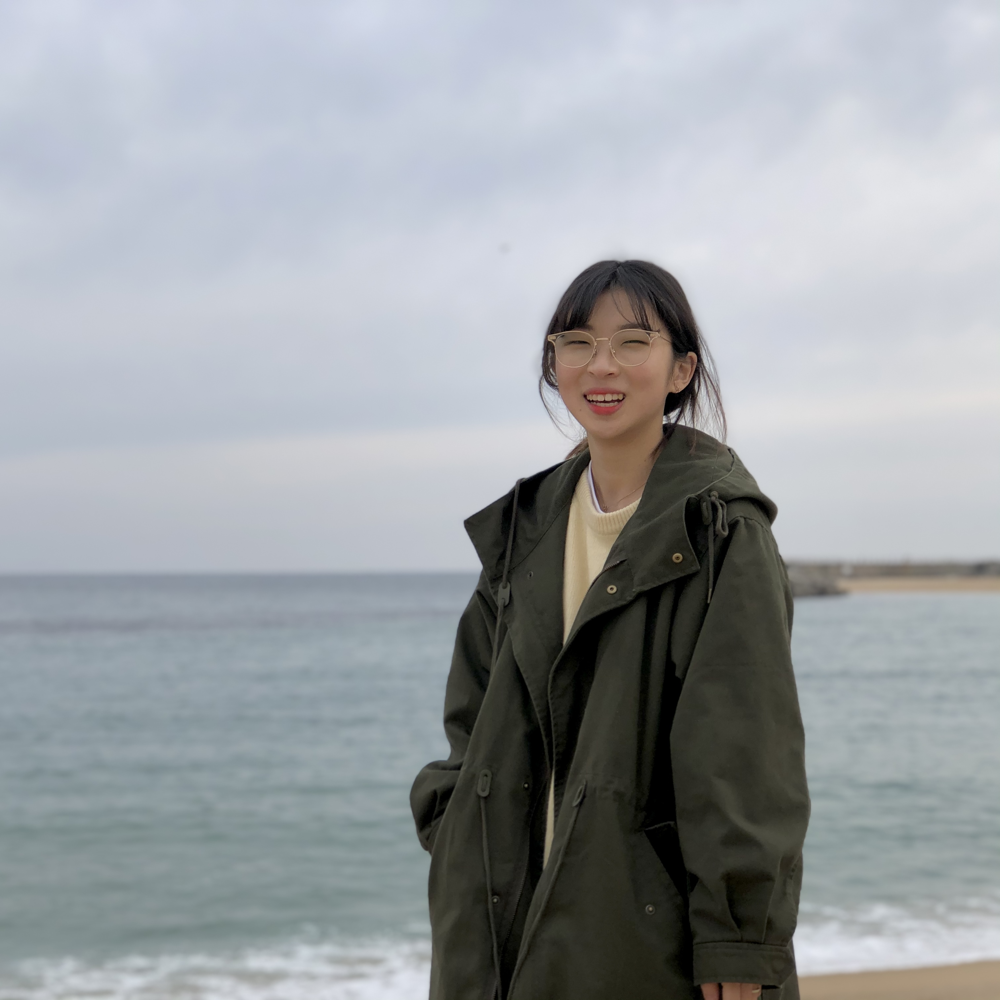

Good day​​ Wecolme to my GitHub. My name is **Sorang Kim**. I am an undergraduate who is interested in **deep learning**. Among deep learning, I am interested in **learning for generalization** and studying to solve the **limitations of deep learning** like **meta-learning** and **Lifelong-learning**.

## Education

**Ulsan National Institute of Science and Technology (UNIST)**. Mar 2018 - Now

- Major : School of Computer Science Engineering (CSE).
- Minor : School of Industrial Engineering (IE).

## Experience

- [**Machine Intelligence and Information Learning lab**](https://sites.google.com/view/swyoon89/research-interests) Intern. July 2020 - Now

- **[brew AI neo scientists (brAIns)](https://sites.google.com/view/unist-brains?fbclid=IwAR0hv0jCFM27Bo37Fu9z_dy7Ni9_yis5vzNfUex2xaXTOMDJVKGFzw1twTo)**. Jan 2021 - Now

- **Do:main**(Start-Up) Software Developer & Designer. Aug 2019 - Feb 2020

- **Entrepreneurship & Data Science Summer Camp** (@University of Illinois at Urbana-Champaign) Cooperation with **[Creasion](https://iventure.illinois.edu/2019/06/01/creasion-creating-a-sustainable-water-source-for-indonesian-communities/)**. July 2019

  

## Skills

- Programming skills : Python, C, C++, MATLAB

- Languages: Korean, English

  

## Social Info

- E-mail : solangii@unist.ac.kr
